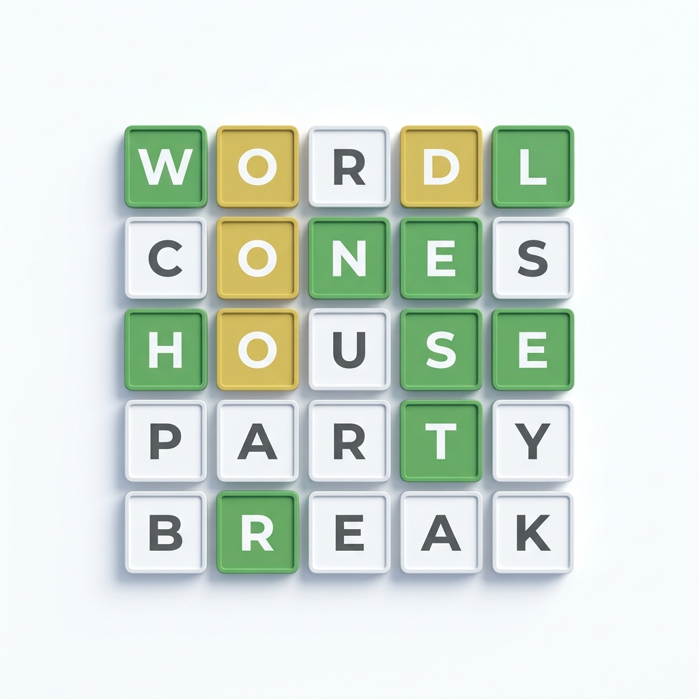

# 🟩 Wordle Unlimited ⬜🟨

A premium, fully localized, and SEO-optimized Wordle experience. Play the original daily puzzle, unlimited mode, or challenge your friends with custom words.



## 🌟 Key Features

- **🌍 Multi-Language Support**: Fully localized in English (US), English (UK), and Spanish.
- **📅 Daily Mode**: Solve the official **"Word of the Day"** (or **"La Palabra del Día"**) every 24 hours.
- **♾️ Unlimited Mode**: Never stop playing! New words on demand.
- **💡 Daily Hints**: Categorized hints to help you solve the daily puzzle without spoiling the answer.
- **🤝 Challenge Mode**: Create custom word links and challenge your friends.
- **📈 Advanced Stats**: Track your win streaks and guess distribution across all modes.
- **🎨 Premium UI**: Modern, responsive design with animations, dark mode, and sleek aesthetics.
- **🔍 SEO Optimized**: Dynamic meta tags, canonical links, and language-specific keywords (**"La Palabra del Día"**) for maximum search visibility.

## 🛠️ Tech Stack

- **Framework**: [React.js](https://reactjs.org/)
- **Styling**: Vanilla CSS (Premium Custom Design)
- **Icons**: Custom SVG Icons
- **Deployment**: Vite-ready

## 🚀 Getting Started

### Prerequisites

- [Node.js](https://nodejs.org/) (v14 or higher)
- npm or yarn

### Installation

1. Clone the repository:
   ```bash
   git clone https://github.com/Naveed-CoLab/Wordle-Unlimited.git
   ```

2. Install dependencies:
   ```bash
   npm install
   ```

3. Run the development server:
   ```bash
   npm run dev
   ```

## 📍 Localization Slugs

The application uses dynamic routing for different locales and SEO optimization:

- **English (US)**: `/` (Default)
- **English (UK)**: `/uk/` (Regional spellings like "colour")
- **Spanish**: `/es/` (Full Spanish localization)

### SEO-Optimized Daily Slugs:
- `/wordle-today` (English)
- `/es/palabra-del-dia` (Spanish)

## 🧩 Project Structure

```text
src/
├── components/     # UI Components (Grid, Keyboard, Header, etc.)
├── words.js        # Word validation and random logic
├── wordDb.js       # English/UK word database
├── wordDbEs.js     # Spanish word database
└── App.jsx         # Main application logic & SEO engine
```

## 📝 License

Distributed under the MIT License. See `LICENSE` for more information.

---

Built with ❤️ for word game lovers. 🟩🟩🟩🟩🟩
